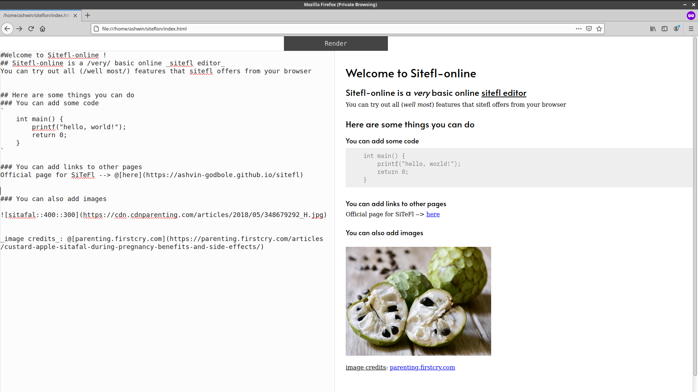

# siteflon
Siteflon is an online editor for the SiTeFl markup language

### screenshot

(the .go file is the original code, and the .js file has been generated using [gopherjs](https://github.com/gopherjs/gopherjs)
